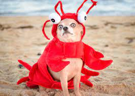

# Chapter 4

Exercises for [chapter 4](https://faculty.washington.edu/otoomet/info201-book/git-basics.html)

* Ex 1: git basics: set up git, fork-clone-edit readme-commit-push
* Ex 2: add files (image)
* Ex 3: play with branches

## Breakfast

1. Coffee
2. Waffles and Syrup

## Funny image :D

I found this image on google, it was the first image that popped up when I typed in "funny image". Its a weird looking dog in a lobster costume. I don't know if its funny but whatever.